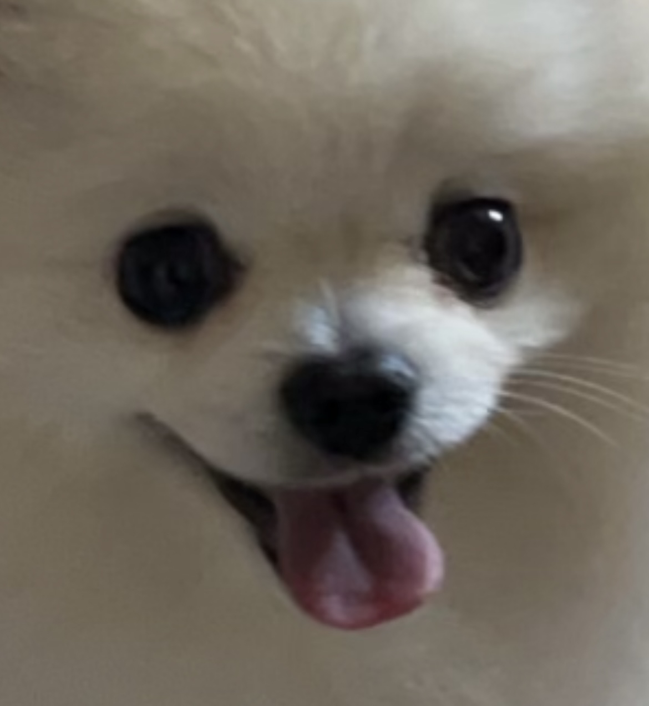
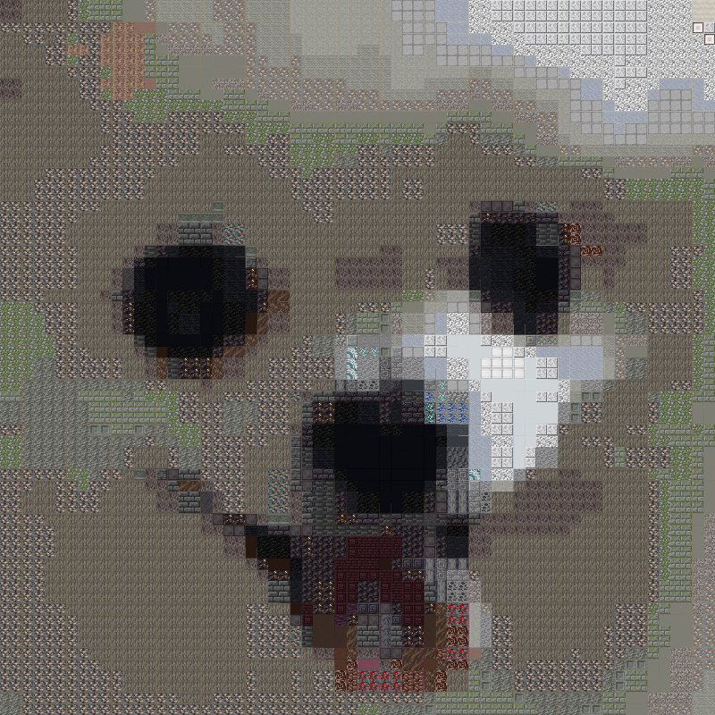

# Minecraft Image Converter 

## Description
Pixelate is a tool to convert any image into Minecraft block mosaics, with a generated list of required blocks for building in-game. This allows the user to "import" their favorite images into Minecraft.

I created this tool because I wanted to build my dog Chewy into my Minecraft world, but I didn't know what blocks to use.

Video Demo: [Watch on YouTube](https://youtu.be/OLdn-PvBAec)


## Screenshots




## Features
- Converts an input image into **Minecraft art mosaics** using real block textures ingame

- Supports custom dimensions (default 16x16, up to 128x128)  
- Generates a materials table, allowing the user to collect the required blocks  
- Outputs both:  
  - `pixelated.png` → pixelated image of the input image, allowing the user to see the comparison with the final output
  - `mc_mosaic.png` → final Minecraft mosaic, made out of block textures


## How It Works
**1. Block Preprocessing**  
   - Each Minecraft block texture (stored in `/blocks`) is analyzed.  
   - Average RGB color values are computed for each block (since textures aren’t homogeneous).  
   - Results are stored in a dictionary for fast lookup.  

**2. Image Pixelation**  
   - Input image is cropped to a square, then resized to a low dimension (default 16x16).  
   - This creates a simplified “pixelated” version where each pixel corresponds to one block.  

**3. Block Replacement**  
   - For each pixel, the closest matching Minecraft block is chosen.  
   - Euclidean distance in RGB space is used for color matching.  
   - Note: While more advanced color spaces (HSV, CIEDE2000) could improve results, Euclidean distance was chosen for simplicity and performance.  

**4. Output**  
   - A final mosaic image is generated.  
   - A materials usage report is printed to the terminal via `PrettyTable`:


## 📦 Installation & Setup
### Requirements
- Python 3.10 or higher
- Dependencies listed in "requirements.txt"

**1.** Clone the repository:  
   ```bash
   git clone https://github.com/yourusername/minecraft-image-converter.git
   cd minecraft-image-converter
   ```
**2.** Install dependencies:
   ```bash
   pip install -r requirements.txt
   ```

## Usage
**1.** Put the image you want to convert into the folder `/blocks`
**2.** Run from terminal:
```bash
   python pixelate.py images/image.png [size]
```
- `image.png` → input image (.jpg, .jpeg, or .png). Make sure it is in the images folder.
- `[size]` → optional mosaic dimension (1-128, default = 16)
**Example:**
```bash
python pixelate.py images/chewy.png 64
```
Output files are saved in `/output`:
- `pixelated.png`
- `mc_mosaic.png`


## Design Notes
- **Maximum size:** 128×128 blocks  
- Larger mosaics give more detail but cause block textures to lose recognizability.  
- Since the purpose is to recreate mosaics in-game, block clarity was prioritized.  
- Viewing distance: Mosaics are best viewed from farther away, just like pixel art.  
- Block selection: Transparent and overly multicolored textures (e.g., glass, glazed terracotta) were excluded from `/blocks` to avoid misleading averages.  


# Technologies
- **Language**: Python
- **Libraries**: 
    - Pillow(PIL) → image processing
    - PrettyTable → ASCII materials table
- **Algorithm**: average RGB analysis + nearest-neighbor search


# Future Improvements
- Deploy as web app(Flask + frontend upload form)
- Add support for non-square images
- Explore other color spaces like CIEDE2000 for more realistic matching
- Optimize with NumPy vectorization or KD-Tree nearest-neighbor search


# Author
**Nathan Ly**
-Github: github.com/nathanjly
-Email: nathanjly.njl@gmail.com
